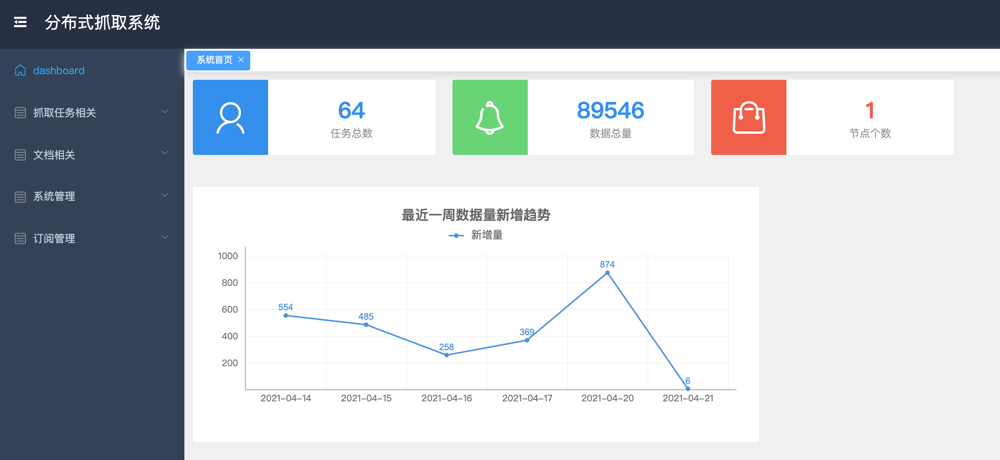
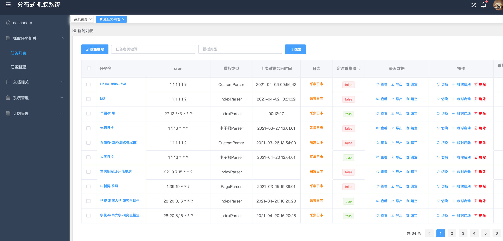
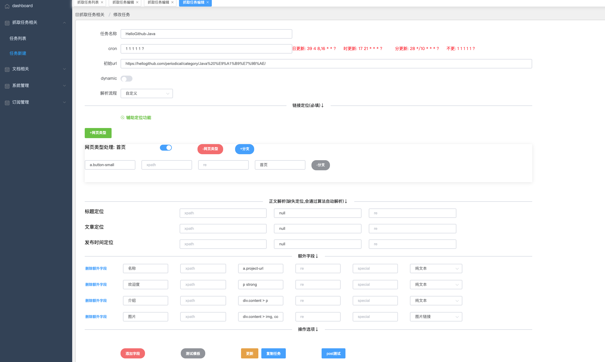
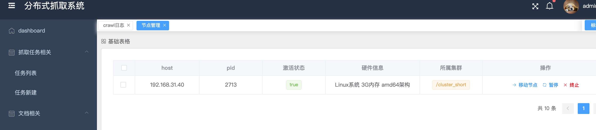
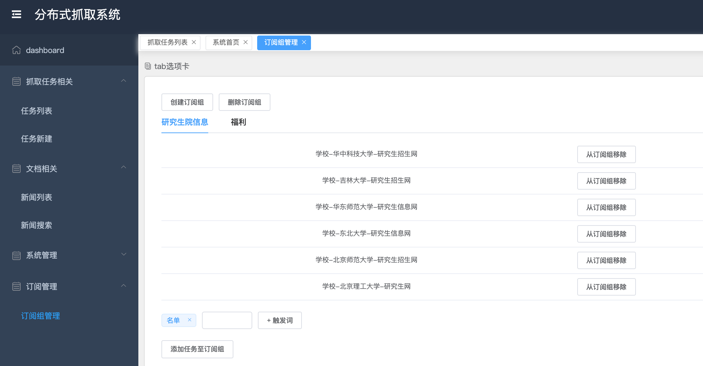

## 项目介绍

本项目是分布式通用爬虫,主要含有功能 
1. 任务创建:支持4种固定模板+自定义模板 快速创建任务
2. 任务管理:开启、暂停
3. 抓取结果:搜索、查看、下载
4. 节点管理:对抓取节点的状态查看与集群切换
5. 自动生成定位器:通过点击生成css选择器,不需要手写xpath
6. 正文提取:基于本文密度算法,自动提取新闻标题、时间、正文
7. 监控订阅更新:用于监控 985大学研究生招生网站、各大招投标网站、用户自定义网站等,一旦有更新并触发关键词,会进行邮件通知

项目技术栈:Vue+SpringBoot+WebMagic  
中间件:Zookeeper+Redis  
数据库:MongoDB  

### 使用说明
要求环境安装JDK11,Redis,Zookeeper,MongoDB
1. 本项目前后端分离,前端框架为Vue(后续会开源),后端框架为SpringBoot(已经开源)
2. 打包:在根目录进行运行 `mvn install`,会在X-Dispatcher和X-Spider各自上生成可执行的jar包
3. 部署:X-Dispatcher项目为管理节点(只部署1个),X-Spider是抓取节点(可部署多个)
4. 本项目核心功能已经开发完后

### Web页面 

dashBoard

任务管理页面

任务编辑界面

可视化辅助定位器

抓取结果管理页面

节点管理

订阅组管理

邮件通知

